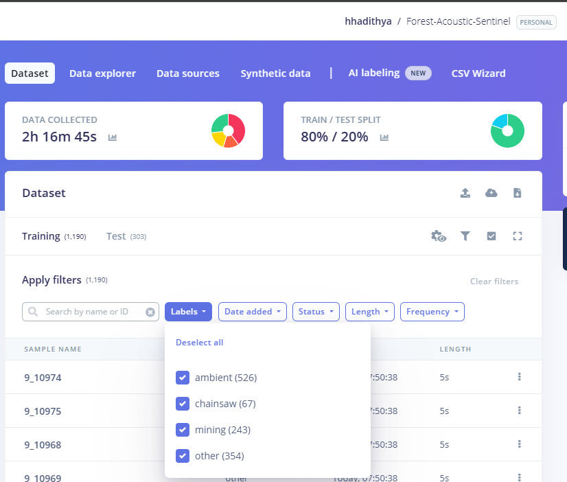

# SilentScout - Acoustic Threat Detection System

We're building a system that listens for illegal chainsaw and mining sounds in forests and sends out LoRa alerts when it picks something up. The whole thing runs offline - no WiFi, no cloud - just an ESP32-S3 doing edge inference on audio and pushing alerts over 433MHz LoRa.

## How it works

Basically there's a sensor node sitting out in the forest with a mic and an ML model. When it hears something suspicious (chainsaw, mining equipment), it classifies the sound using Edge Impulse, and if it's confident enough (85%+) for 3 consecutive readings, it fires off a LoRa packet to a gateway node. That gateway is plugged into a laptop running our Electron dashboard.

```
  Sensor Node                   LoRa 433MHz              Gateway              Desktop
┌─────────────┐                                    ┌──────────────┐     ┌──────────────┐
│  ESP32-S3   │ ──────────────────────────────────▶│  LoRa RX     │────▶│  Electron    │
│  INMP441    │            wireless                │  (USB serial)│     │  Dashboard   │
│  SX1278 TX  │                                    └──────────────┘     └──────────────┘
│  Solar+Batt │
└─────────────┘
```

## Repo structure

- **`firmware/`** - ESP32-S3 PlatformIO project (the sensor node)
- **`desktop-app/`** - Electron app for monitoring alerts and node status

## Firmware (sensor node)

- ESP32-S3 DevKitC-1 with 16MB flash and 8MB PSRAM
- INMP441 MEMS mic over I2S, sampling at 16kHz
- Edge Impulse model runs locally - classifies chainsaw / mining / ambient
- LoRa SX1278 433MHz for sending alerts (no WiFi needed)
- Solar + 18650 battery, uses light sleep to save power
- Needs 3 consecutive detections at 85%+ confidence before triggering alert

Check [firmware/README.md](firmware/README.md) for wiring and build steps.

## Desktop app

- Electron 29 with serial port connection to gateway
- Shows node online/offline status, RSSI over time, alert log, and a Leaflet map
- Expects newline-delimited JSON at 115200 baud

## Hardware used

| Part | Model | Connection |
|------|-------|------------|
| MCU | ESP32-S3 DevKitC-1 N16R8 | - |
| Mic | INMP441 MEMS | I2S - GPIO 1, 2, 42 |
| Radio | Ra-02 SX1278 433MHz | SPI - GPIO 18, 19, 23, 5, 14, 26 |
| Power | 18650 + Solar Panel | 3.3V rail |

## Dataset

Training data sourced from the [FSC22 dataset on Kaggle](https://www.kaggle.com/datasets/irmiot22/fsc22-dataset/data) - a forest sound classification dataset with 27 audio classes.

We mapped the original classes down to 3 labels that fit the use case:

**Threat (mining / illegal logging)**

| Kaggle Class | Our Label | Reason |
|---|---|---|
| Chainsaw (#11) | chainsaw | Direct match - primary threat signal |
| Axe (#10) | mining | Illegal logging activity |
| Handsaw (#13) | mining | Manual cutting activity |
| WoodChop (#16) | mining | Illegal activity |
| Generator (#12) | mining | Powers illegal mining equipment |

**Ambient / Nature**

| Kaggle Class | Our Label |
|---|---|
| Rain (#2) | ambient |
| Wind (#5) | ambient |
| Silence (#6) | ambient |
| BirdChirping (#23) | ambient |
| Insect (#21) | ambient |
| Frog (#22) | ambient |
| WingFlaping (#24) | ambient |
| TreeFalling (#7) | ambient |
| Squirrel (#27) | ambient |

**Interference / Background Noise**

| Kaggle Class | Our Label |
|---|---|
| VehicleEngine (#9) | other |
| Helicopter (#8) | other |
| Thunderstorm (#3) | other |
| WaterDrops (#4) | other |
| Footsteps (#19) | other |
| Speaking (#18) | other |

Merging related Kaggle classes into broader labels keeps the model focused on what actually matters - detecting threats vs. ignoring noise. The `other` class acts as a catch-all so the model has a safe "none of the above" bucket and doesn't force a threat label on unrelated sounds.

## Model

### Train / Test Split



## Design decisions

- Edge inference on the device itself means zero latency waiting on a server and works in dead zones with no connectivity
- The 3-consecutive-readings rule before alerting cuts down on false positives from short sounds like a single axe swing or a car passing by
- LoRa 433MHz was chosen over higher frequencies for better range and foliage penetration in forested terrain
- Solar + light sleep keeps the node alive indefinitely without manual battery swaps, important for remote deployments
- Newline-delimited JSON over serial is deliberately simple - easy to parse, easy to debug with a plain terminal